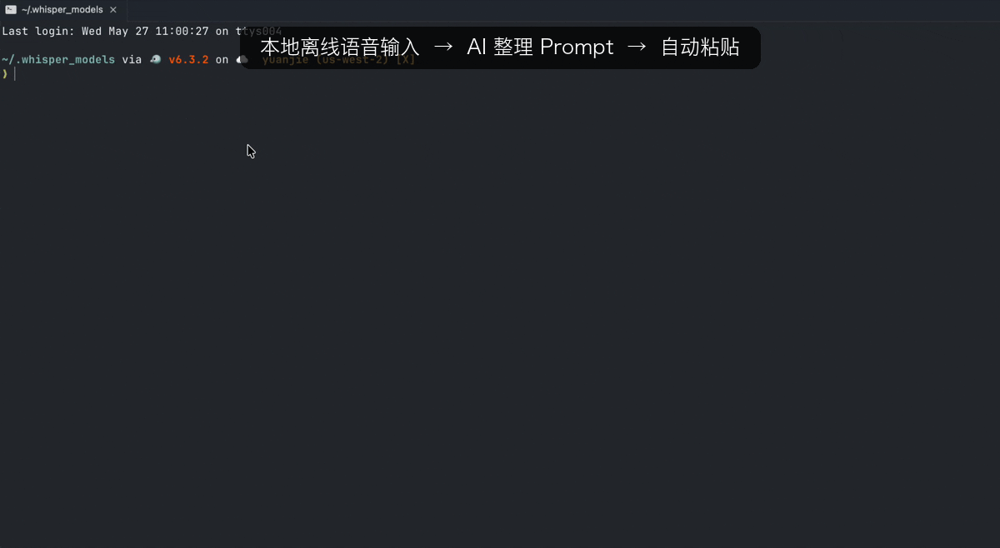

# 🎙️ local-voice-input — 本地 AI 语音 Prompt 输入器

[](https://github.com/aimer1124/local-voice-input/actions/workflows/release.yml)
[](https://github.com/aimer1124/local-voice-input/releases/latest)
[](./LICENSE)
[](#-系统要求)
[](./ROADMAP.md)

> **完全离线** 的程序员专用语音输入工具：按下快捷键说话 → Whisper 转写 → 本地 LLM 提炼意图 → 自动粘贴到光标位置。
>
> _命令行工具名: `vinput`_

**100% 本地运行，音频不出网，无云端依赖，无账号注册。**

[English README](./README.md) · [CHANGELOG](./CHANGELOG.md) · [ROADMAP](./ROADMAP.md) · [Contributing](./CONTRIBUTING.md)



---

## ✨ 核心特性

- 🔒 **完全离线**：Whisper.cpp + Ollama，音频与文本永不上云
- 🧠 **AI 意图重构**：本地 LLM 过滤"呃、那个"等口水词，把碎碎念压成结构化 Prompt
- ⚡ **响应快速**：10 秒中文音频，2–4 秒出文字
- 🎛️ **双模 toggle**：按一下开始 / 再按一下停止，符合直觉
- 🖥️ **多屏感知 HUD**：屏幕中下方毛玻璃悬浮提示，自动跟随鼠标所在屏
- 🎯 **专业术语友好**：可自定义热词词表，编程英文混读不翻车
- 🔌 **零配置可用**：默认中文，开箱即用；同时所有参数均可外置配置

---

## 🎬 工作流程

```
按 ⌘⇧Space (Raycast 快捷键)
       │
       ▼
┌────────────────────────────┐
│  🎙️ 录音中... (HUD 提示)   │  ← Pop 提示音
└────────────────────────────┘
       │
       │  说出你的指令，例如：
       │  "帮我写一个 Python 函数，读取 CSV 然后过滤掉空行"
       │
       ▼
再按 ⌘⇧Space               ← Tink 提示音
       │
       ▼
┌────────────────────────────┐
│  💭 转写中...               │
└────────────────────────────┘
       │  ↓ Whisper.cpp 转写
┌────────────────────────────┐
│  🤖 AI 润色中...            │
└────────────────────────────┘
       │  ↓ Ollama (qwen2.5:3b) 提炼意图
       │  ↓ pbcopy + osascript ⌘V
       ▼
┌────────────────────────────┐
│  ✓ 已完成                   │
└────────────────────────────┘
       │
       ▼
   光标位置自动出现整理过的 Prompt
```

---

## 🧠 整体机制

### 系统架构

```
┌─────────────────────────────────────────────────────────────┐
│                       Raycast 全局快捷键                     │
└────────────────────────────┬────────────────────────────────┘
                             │
                             ▼
┌─────────────────────────────────────────────────────────────┐
│  voice-input.sh (Raycast Script Command)                    │
│     └─ exec vinput_bg.sh                                    │
└────────────────────────────┬────────────────────────────────┘
                             │
                             ▼
┌─────────────────────────────────────────────────────────────┐
│  vinput_bg.sh (主逻辑)                                       │
│                                                              │
│   并发锁 (mkdir 原子性)                                       │
│      ├─ 首次按键 → record 模式                                │
│      └─ 二次按键 → toggle 模式（SIGINT 通知 rec 优雅退出）    │
│                                                              │
│   ┌───────┐    ┌──────────┐    ┌────────┐    ┌──────────┐  │
│   │ SoX   │ →  │ Whisper  │ →  │ Ollama │ →  │ pbcopy + │  │
│   │ rec   │    │ -cli     │    │ qwen   │    │ ⌘V       │  │
│   └───┬───┘    └──────────┘    └────────┘    └──────────┘  │
│       │                                                      │
│       │       30s 守护进程 (硬超时保底)                       │
│       │                                                      │
│   ┌───▼───┐                                                  │
│   │  HUD  │ ← 每个阶段切换屏幕中央提示                       │
│   └───────┘                                                  │
└─────────────────────────────────────────────────────────────┘
```

### 关键机制详解

#### 1. 双模 toggle 锁机制

`/tmp/vinput.lock.d` 同时充当 **互斥锁 + 状态机**：

| 状态 | mkdir 结果 | PID 文件 | 行为 |
|---|---|---|---|
| 全新会话 | 成功 | 创建 | 进入 record 模式，开始录音 |
| 录音中再按快捷键 | 失败 | 存在 | toggle 模式，发 SIGINT 让 rec 优雅停止 |
| 转写阶段再按 | 失败 | 已删除 | 显示"正在处理上次录音" |
| 残留锁（异常退出）| 失败 | PID 已死 | 自动清理后重新开始 |

`mkdir` 是原子的，比 `flock` 更可移植（macOS 不自带 `flock`）。

#### 2. 录音控制（USE_VAD 双模）

**默认 USE_VAD=0（推荐）**：
- `rec` 按下立即开始录音，不管音量
- 二次按键发 SIGINT 立即停
- 30s 硬超时兜底，防忘按停

**可选 USE_VAD=1**：
- 加 SoX silence 滤波：1.5s 静音自动停
- 仅适合安静环境（环境噪音超过阈值会停不下来）

#### 3. Whisper 转写

- 模型：`ggml-large-v3-turbo-q5_0`（547MB，Apple Silicon Metal 后端）
- 通过 `--prompt` 注入热词词表，提升专业术语准确率
- 强制 `-l zh` 中文模式，对中英混读靠 prompt 引导

#### 4. LLM 意图润色（短文本跳过优化）

- 短于 `SHORT_TEXT_THRESHOLD`（默认 15 字）→ 直接采用原文，省 1–2 秒
- 长文本 → 调 Ollama，`keep_alive=30m` 让模型常驻显存
- 失败时回退到原始 Whisper 结果

**LLM Prompt 设计**：
```
你是一个高效率的程序员指令提炼器。规则：
1. 过滤语气词（呃、那个、啊）
2. 中途自我纠正只保留最终意图
3. 口语转化为书面硬核 Prompt 格式
4. 严禁解释/寒暄，直接输出最终文本
```

#### 5. 屏幕中央 HUD

- Swift 编写，约 240 行，编译成 ~116KB 单文件二进制
- 使用 `NSVisualEffectView` + `.hudWindow` 材质，效果跟系统音量调节弹窗一致
- 通过 `/tmp/vinput_hud.pid` 维护单例：新 HUD 启动时杀掉旧的
- 鼠标穿透、跨 Space 显示、自适应文字宽度
- 多屏识别：用 `NSEvent.mouseLocation` 命中鼠标所在屏幕

#### 6. UTF-8 编码处理

Raycast 启动的子进程不继承 Terminal 的 LANG，导致 `pbcopy` 把 UTF-8 中文字节当 Latin-1 处理，粘贴出乱码。脚本强制：
```bash
export LANG="${LANG:-en_US.UTF-8}"
export LC_ALL="${LC_ALL:-en_US.UTF-8}"
```

---

## 📦 安装

### Homebrew Tap（推荐 · v1.1.1+）

```bash
brew tap aimer1124/tap
brew install local-voice-input
vinput setup
```

`vinput setup` 是 Homebrew 包装的"二段式"补全 —— `brew install` 只负责把脚本和 HUD 二进制部署到 `libexec/`，下面这些会在 `vinput setup` 里完成：

1. `brew install sox jq whisper-cpp ollama`（已存在则跳过）
2. 下载 Whisper `large-v3-turbo-q5_0` 模型（~547MB）
3. 把 `vinput / vinput.sh / vinput_bg.sh / hud` 软链到 `~/.whisper_models/`
4. 写入默认配置 `~/.config/vinput.conf` + 热词词表
5. 部署 Raycast 命令脚本到 `~/.config/raycast-scripts/`
6. 启动 Ollama 服务 + 拉取 `qwen2.5:3b`（~2GB）+ 预热

升级：`brew upgrade local-voice-input`（脚本是 symlink，自动跟随版本）。

### 源码安装（开发者 / 不想用 brew）

```bash
git clone https://github.com/aimer1124/local-voice-input.git
cd local-voice-input
./install.sh
```

`install.sh` 走的是历史路径：自动检查 Homebrew → `brew install` 依赖 → `brew install --cask raycast` → 下载 Whisper 模型 → 编译 / 下载 HUD 二进制 → 复制脚本到 `~/.whisper_models/` → 预热 Ollama。和 `vinput setup` 等价，只是不依赖 brew tap。

支持几个开关（可组合，`--help` 看全部）：

```bash
./install.sh --dry-run        # 只检查环境 + 打印将执行的动作，不下载/不写任何文件
./install.sh --upgrade-only   # 只刷新脚本和 HUD，跳过依赖与模型（升级最快）
./install.sh --skip-models    # 跳过 Whisper(~550MB)+Ollama(~2GB) 下载（离线机用 USB 拷模型）
```

### 手动配置（自动化无法覆盖的部分）

完成 `install.sh` 后，还需要在系统设置里：

1. **隐私 → 麦克风**：勾选 Raycast（首次触发时 sox 会自动弹窗，点允许）
2. **隐私 → 辅助功能**：勾选 Raycast（用于自动 ⌘V 粘贴）
3. **Raycast 设置 → Extensions → Script Commands**
   - Add Script Directory：`~/.config/raycast-scripts`
   - 给 `🎙️ 语音输入` 绑定快捷键（推荐 `⌘⇧Space`）

> 漏了第 2 步也不会卡死：辅助功能没授权时，转写结果会照常进剪贴板，vinput 会提示
> 「📋 已复制到剪贴板 · 自动粘贴需勾选辅助功能」并**自动帮你打开对应设置面板**，授权
> 后即恢复自动粘贴。授权前手动按 `⌘V` 即可。

### 系统要求

- macOS 13+
- Apple Silicon（M1/M2/M3/M4）
- 16 GB 内存推荐（8 GB 也能跑）
- 3 GB 磁盘空间
- 能用的麦克风（**注意**：纯音乐用的 3 极有线耳机会让 macOS 把输入路由到无信号的耳机口）

---

## 🚀 使用

### 基础用法

1. 把光标点进任意文本框（编辑器、浏览器、聊天窗口都行）
2. 按你设的快捷键（如 ⌘⇧Space）
3. 听到 Pop 音后说话
4. 说完再按一次快捷键
5. 等 2–4 秒，文字自动粘贴到光标位置

### 性能预算（10 秒中文音频）

| 阶段 | 耗时 |
|---|---|
| 录音 | 你说多久就多久 |
| Whisper 转写 | ~2 s |
| Ollama 润色 | ~1 s（短文本跳过）/ ~2 s（长文本）|
| 粘贴 | < 0.1 s |
| **总额外延迟** | **2–4 秒** |

---

## ⚙️ 配置

配置集中在 `~/.config/vinput.conf`。**设计原则是开箱即用** —— 默认模板只放「大多数人真正会改」的几项，全部带推荐默认值；删掉或留空任意一项都会回退到内置默认，不会报错：

```bash
# === Whisper ASR ===
MODEL_PATH="$HOME/.whisper_models/ggml-large-v3-turbo-q5_0.bin"
WHISPER_LANG="zh"              # 中英混读靠热词 prompt 引导

# === Ollama LLM 润色 ===
OLLAMA_MODEL="qwen2.5:3b"
OLLAMA_URL="http://localhost:11434"
SHORT_TEXT_THRESHOLD=15        # 短于此字数（中文 1 字=1）跳过 LLM，省 1–2 秒

# === 录音 / 粘贴行为 ===
AUTO_PASTE=1                   # 1=自动 ⌘V（需辅助功能权限），0=只复制
USE_VAD=0                      # 0=纯 toggle（推荐），1=静音自动停（仅安静环境）
MAX_REC_SECONDS=30             # 录音硬超时（秒）
SOX_GAIN_DB=-3                 # 小声/远离麦克风调大：+6~+12（负=衰减）

# === 热词词表（可选）===
HOTWORDS_FILE="$HOME/.config/vinput_hotwords.txt"
```

> 想调 Whisper 解码内参、SoX 滤波、动态 prompt、VAD 阈值等？见下方 [进阶配置](#-进阶配置)。这些默认值已针对中文 + 程序员场景调优，一般不用动。

### 热词词表

`~/.config/vinput_hotwords.txt`，每行一个术语，会注入 Whisper prompt 提升识别准确率：

```
API
Promise
async
Playwright
PostgreSQL
...
```

### HUD 样式调整

无需重新编译，在 `~/.config/vinput.conf` 里设置即可，下次触发就生效：

| 配置项 | 默认 | 说明 |
|---|---|---|
| `HUD_Y_PERCENT` | `18` | 距屏幕底部百分比（0=贴底 / 50=正中 / 100=贴顶） |
| `HUD_HEIGHT` | `96` | 窗口高度（像素） |
| `HUD_FONT_SIZE` | `26` | 字号 |
| `HUD_FONT_WEIGHT` | `semibold` | `ultraLight`/`thin`/`light`/`regular`/`medium`/`semibold`/`bold`/`heavy`/`black` |
| `HUD_CORNER_RADIUS` | `20` | 圆角弧度 |
| `HUD_MATERIAL` | `hudWindow` | 毛玻璃风格：`hudWindow`/`sidebar`/`popover`/`menu`/…（详见 `NSVisualEffectView.Material`） |
| `HUD_WIDTH_MIN` | `220` | 自适应宽度下限 |
| `HUD_WIDTH_MAX` | `900` | 自适应宽度上限 |

也支持单次临时覆盖（不动配置文件）：
```bash
HUD_Y_PERCENT=50 HUD_FONT_SIZE=36 ~/.whisper_models/hud "测试样式" 2
```

---

## 🧩 进阶配置

下面这些**没有放进默认配置模板**，因为默认值已针对中文 + 程序员场景调优，绝大多数人不用动。
需要时手动加进 `~/.config/vinput.conf` 即可（留空 = 用内置默认，不会报错）。改 Whisper/LLM
相关项后请按 [回归测试](#-回归测试pre-tag-必跑) 跑一遍再用。

### Whisper 解码内参

```bash
WHISPER_THREADS=8             # 推理线程数
WHISPER_BEAM_SIZE=5           # beam search 路数，减少同音字误选；延迟 +0.5s
WHISPER_TEMPERATURE_INC=0.2   # 温度递增步长，失败时温度采样兜底防吐空
# WHISPER_TEMPERATURE=0       # 起始温度，留空=whisper.cpp 默认
# WHISPER_NO_SPEECH_THOLD=0.6 # 越小越严。⚠️ v1.1.3 调严后普通麦全判"非语音"，v1.1.6 改回默认(留空)
# WHISPER_LOGPROB_THOLD=-1.0  # 越接近 0 越严。同上，仅 doctor 显示信号偏弱时再考虑
```

### 动态 Prompt 上下文

把最近 N 次成功转写拼到 Whisper `--prompt` 前，给模型「短期记忆」。实测连续聊同一话题时专有名词命中率 +20~40%。

```bash
USE_RECENT_PROMPT=1
RECENT_PROMPT_COUNT=5
RECENT_PROMPT_FILE="$HOME/.cache/vinput/recent.txt"
RECENT_PROMPT_MAX_CHARS=280
```

### SoX 录音预处理

> ⚠️ 所有效果必须 streaming-safe（不能依赖整流 buffer）。v1.1.4 用过 `norm -3`，导致 rec 在 SIGINT 时 0 帧输出 → "未识别到有效语音"。v1.1.7 改回固定 gain。

```bash
USE_SOX_PREPROCESS=1
SOX_HIGHPASS=80     # 切低频：风扇 / 街道嗡嗡声
SOX_LOWPASS=8000    # 切高频：嘶嘶声 / 抖动
SOX_GAIN_DB=-3      # 固定增益（已在基础配置，此处列全）
REC_WARMUP_MS=150   # rec 启动后等 buffer 就绪再提示说话，避免首字丢失
```

### VAD 阈值（仅 `USE_VAD=1` 时生效）

```bash
SILENCE_TAIL=1.5
SILENCE_START_THRESHOLD="0.5%"
SILENCE_STOP_THRESHOLD="6%"
```

### HUD 终态显示 & ↑ 重录

```bash
# HUD_SHOW_RESULT=1       # 粘贴后 HUD 显示真正粘贴的内容（截断 60 字）
# HUD_FINAL_DURATION=2.5  # 终态停留秒数
# HUD_RERUN_ON_UP=0       # 1=终态显示期间按 ↑ 立即重跑一次完整流水线（ESC 永远立即关闭）
```

> `HUD_RERUN_ON_UP=1` 需在**系统设置 → 隐私 → 输入监控**给 hud 二进制（路径见 `vinput --doctor`）打勾。
> 没给权限时 HUD 仍正常显示，只是 ↑ 无效——这是个便利功能，默认关。

HUD 外观（位置/字号/材质等 8 项）见上方 [HUD 样式调整](#hud-样式调整)。

---

## 🗂️ 项目结构

```
vinput/
├── README.md                          # English version（默认）
├── README.zh.md                       # 本文档（中文）
├── LICENSE                            # MIT
├── install.sh                         # 一键安装
├── uninstall.sh                       # 卸载
├── bin/
│   ├── vinput.sh                      # 前台手动版（终端 Ctrl+C）
│   └── vinput_bg.sh                   # 后台版（Raycast 调用）
├── raycast/
│   └── voice-input.sh                 # Raycast 命令封装
├── src/
│   └── hud.swift                      # 屏幕中央 HUD 源码
├── config/
│   ├── vinput.conf.example            # 配置模板
│   └── vinput_hotwords.example.txt    # 热词模板
└── assets/                            # 截图/演示资源
```

---

## 🆚 vs 商用输入法

| 维度 | vinput | 微信/讯飞/豆包 |
|---|---|---|
| 隐私 | ✅ 100% 本地 | ❌ 上传云端 |
| 离线可用 | ✅ | ❌ |
| 专业术语 | ✅ 自定义热词 + LLM 重构 | ⚠️ 通用词库 |
| 意图重构 | ✅ AI 提炼成 Prompt | ❌ 只做转写 |
| 流式输出 | ❌ 必须录完才识别 | ✅ 边说边出字 |
| 任意位置直接输入 | ⚠️ 经剪贴板中转 | ✅ 系统级 IME |
| 候选词/纠错 | ❌ | ✅ |
| 方言支持 | ⚠️ 仅普通话强 | ✅ 几十种方言 |

**最佳定位**：把 vinput 当成 **"AI Prompt 口述按钮"**，跟系统输入法分工 —— vinput 用于写给 Claude/Cursor/ChatGPT 的长 prompt，系统输入法用于聊天/密码/短回复。

---

## 🔧 故障排查

**一键诊断**（推荐先跑这个）：
```bash
~/.whisper_models/vinput --doctor
```
会自动检查工具链、资源文件、Ollama 状态、HUD 可用性，并跑一次 3 秒麦克风录音测试，按"健康/偏弱/几乎静音"输出 RMS 值。

| 症状 | 命令 / 操作 |
|---|---|
| Raycast 没反应 | 检查命令是否出现、快捷键有无冲突 |
| 只复制了没自动粘贴 | 系统设置 → 隐私 → 辅助功能 勾选 Raycast（vinput 会自动提示并打开该面板） |
| 录音失败 | `tail -50 /tmp/vinput_debug.log` |
| 不确定哪里出问题 | `~/.whisper_models/vinput --doctor` |
| 麦克风电平测试 | `rec -q /tmp/t.wav trim 0 3 && sox /tmp/t.wav -n stat \| grep RMS` |
| 默认输入设备 | 系统设置 → 声音 → 输入（用 MacBook Pro Microphone） |
| 卡死的录音 | `pkill -f "rec -q"; rm -rf /tmp/vinput.lock.d` |
| Ollama 没启动 | `brew services start ollama` |
| HUD 不显示 | `~/.whisper_models/hud "测试" 2` |
| 中文乱码 | 确认脚本含 `export LANG="en_US.UTF-8"` |

---

## 📚 进阶

### 切换更快的 Whisper 模型

| 模型 | 体积 | 速度 | 中文质量 |
|---|---|---|---|
| `ggml-tiny.bin` | 75 MB | 极快 | 差 |
| `ggml-base.bin` | 142 MB | 快 | 一般 |
| `ggml-small.bin` | 466 MB | 中等 | 中等 |
| **`ggml-large-v3-turbo-q5_0.bin`** | **547 MB** | **快** | **强烈推荐** |
| `ggml-large-v3.bin` | 3 GB | 慢 | 最高 |

### 切换更快的 Ollama 模型

| 模型 | 速度 | 润色质量 |
|---|---|---|
| `qwen2.5:1.5b` | ⚡⚡⚡ | 一般 |
| **`qwen2.5:3b`** | **⚡⚡** | **平衡（推荐）** |
| `qwen2.5:7b` | ⚡ | 更强 |
| `gemma2:2b` | ⚡⚡⚡ | 替代选择 |

```bash
ollama pull qwen2.5:1.5b
# 然后改 ~/.config/vinput.conf 里的 OLLAMA_MODEL="qwen2.5:1.5b"
```

---

## 📜 转写历史 & 错词挖掘

每次成功转写都会 append 到 `~/.cache/vinput/history.jsonl`（纯本地，纯文本）。

```bash
vinput history                  # 最近 20 条彩色表格
vinput history --tail 100       # 最近 100 条
vinput history --grep qwen      # 搜索（在 raw/corrected/cleaned 三列）
vinput history --raw-only       # 只看原始 Whisper 输出（便于 grep 错词）
```

发现错词后一条命令补进纠错表：

```bash
vinput add-correction "Claude Code" "克劳德 code"
```

> 隐私：日志只在本地，永不出机。要清空就 `rm ~/.cache/vinput/history.jsonl`。

---

## 🧪 回归测试（pre-tag 必跑）

三层 ASR 流水线 = 三组测试套件 + 一个 lint：

| 层 | 套件 | 命令 | 价值 |
|---|---|---|---|
| Whisper 转写 | [`tests/asr/`](./tests/asr/) | `bash tests/asr/run.sh` | 6 条 TTS 音频 + CER 预算 |
| 谐音纠错 | （数据驱动，无需测） | `vinput corrections` | TSV 即真值 |
| LLM 整形 | [`tests/llm/`](./tests/llm/) | `bash tests/llm/run.sh` | 6 个 case + 必含/绝不含约束 |
| 防御性 | `scripts/lint-shell.sh` | `bash scripts/lint-shell.sh` | grep `$VAR<非ASCII>` set -u 陷阱 |

修改 `bin/vinput_bg.sh`、Whisper/LLM 参数、`config/*` 之前**必须跑**对应层。退出码 0 才能 tag。

> 为什么：v1.1.3 → v1.1.7 四个 hotfix 都是「改了 ASR 参数没回归」的产物。v1.1.5 / v1.1.8 又
> 是 `set -u` 中文括号陷阱。这套基建直接挡掉这两个 bug class。

## 🤝 贡献

欢迎 PR / Issue。建议方向：
- 给回归套件 [tests/asr/](./tests/asr/) 提样本（真人录音、方言、噪声场景）
- Linux/Windows 移植（替换 Raycast、osascript、HUD）
- 流式识别（whisper-streaming / faster-whisper）
- 不依赖剪贴板的直接注入（用 CGEventPost 输入 Unicode）
- 更多语言/方言模型预设

---

## 📄 License

MIT —— 详见 [LICENSE](./LICENSE)

---

## 🙏 致谢

- [whisper.cpp](https://github.com/ggerganov/whisper.cpp) — Whisper 本地推理
- [Ollama](https://ollama.com/) — 本地 LLM 引擎
- [Qwen](https://github.com/QwenLM/Qwen) — 阿里巴巴开源 LLM
- [Raycast](https://www.raycast.com/) — 现代化 macOS Launcher
- [SoX](http://sox.sourceforge.net/) — 音频录制工具链
